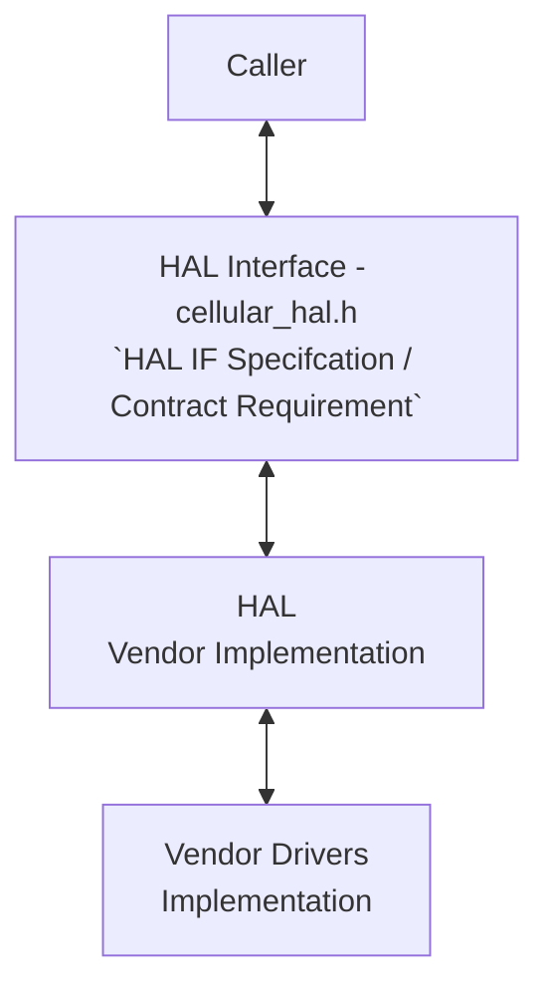

# CELLULAR MANAGER HAL Documentation

## Acronyms

- `HAL` \- Hardware Abstraction Layer
- `RDK-B` \- Reference Design Kit for Broadband Devices
- `OEM` \- Original Equipment Manufacture

## Description

The diagram below describes a high-level software architecture of the Cellular Manager HAL module stack.

Cellular Manager HAL is an abstraction layer, implemented to interact with vendor software's for managing access to cellular network, managing cellular modem power configuration, exposing radio resources information of the cellular interface, managing SIM use etc.

## Component Runtime Execution Requirements

### Initialization and Startup

The below mentioned initialization API initializes the Cellular HAL layers/code.

- `cellular_hal_init()`

3rd party vendors will implement appropriately to meet operational requirements. This interface is expected to block if the hardware is not ready.

## Threading Model

Cellular HAL is not thread safe.

Any module which is invoking the Cellular HAL api should ensure calls are made in a thread safe manner.

Vendors can create internal threads/events to meet their operation requirements.  These should be responsible to synchronize between the calls, events and cleaned up on closure.

## Process Model

All API's are expected to be called from multiple process.

## Memory Model

### Caller Responsibilities

Manage memory passed to specific functions as outlined in the API documentation. This includes allocation and proper deallocation to prevent leaks.

### Module Responsibilities

Handle and deallocate memory used for its internal operations.
Release all internally allocated memory upon closure to prevent leaks.

TODO:
State a footprint requirement. Example: This should not exceed XXXX KB.

## Power Management Requirements

The Cellular HAL is not involved in any of the power management operation.

## Asynchronous Notification Model

There are no asynchronous notifications.

## Blocking calls

Cellular HAL API's are expected to work synchronously and should complete within a time period commensurate with the complexity of the operation and in accordance with any relevant specification.
Any calls that can fail due to the lack of a response should have a timeout period in accordance with any relevant documentation.

TODO:
As we state that they should complete within a time period, we need to state what that time target is, and pull it from the spec if required. Define the timeout requirement.

## Internal Error Handling

All the Broadband Cellular HAL APIs should return error synchronously as a return argument. While HAL is responsible for managing internal system errors, such as out of memory conditions, it's important to note that the interface level may not always handle recovery from severe system errors effectively. Instead, HAL should prioritize graceful handling of recoverable errors and logging critical issues for further investigation and resolution.

## Persistence Model

There is no requirement for HAL to persist any setting information. Application/Client is responsible to persist any settings related to their implementation.

## Nonfunctional requirements

Following non functional requirement should be supported by the Cellular HAL component.

## Logging and debugging requirements

The component should log all the error and critical informative messages, preferably using syslog, printf which helps to debug/triage the issues and understand the functional flow of the system.

The logging should be consistent across all HAL components.

If the vendor is going to log then it has to be logged in cellular_vendor_hal.log file name which can be placed in /rdklogs/logs/ directory.

Logging should be defined with log levels as per Linux standard logging. The logging levels specified by the Linux standard logging, in descending order of severity, are FATAL, ERROR, WARNING, NOTICE, INFO, DEBUG, TRACE.

## Memory and performance requirements

Make sure Cellular HAL is not contributing more to memory and CPU utilization while performing normal operations and Commensurate with the operation required.

## Quality Control

To ensure the highest quality and reliability, it is strongly recommended that third-party quality assurance tools like Coverity, Black Duck, and Valgrind be employed to thoroughly analyze the implementation. The goal is to detect and resolve potential issues such as memory leaks, memory corruption, or other defects before deployment.

Furthermore, both the HAL wrapper and any third-party software interacting with it must prioritize robust memory management practices. This includes meticulous allocation, de-allocation, and error handling to guarantee a stable and leak-free operation.

## Licensing

Cellular HAL implementation is expected to released under the Apache License 2.0.

## Build Requirements

The source code should be capable of, but not be limited to, building under the Yocto distribution environment. The recipe should deliver a shared library named as `cellularmanager.so`
  
## Variability Management

The role of adjusting the interface, guided by versioning, rests solely within architecture requirements. Thereafter, vendors are obliged to align their implementation with a designated version of the interface. As per Service Level Agreement (SLA) terms, they may transition to newer versions based on demand needs.

Each API interface will be versioned using [Semantic Versioning 2.0.0](https://semver.org/), the vendor code will comply with a specific version of the interface.

## Platform or Product Customization

None

## Interface API Documentation

All HAL function prototypes and datatype definitions are available in `cellular_hal.h` file.

  1. Components/Process must include `cellular_hal.h` to make use of Cellular Manager hal capabilities.
  2. Components/Process should add linker dependency to `cellularmanager.so`

## Theory of operation and key concepts

### Object Lifecycles

| Aspect | Description |
|---|---|
| **Creation** | The `cellular_hal_init()` function initializes the Cellular HAL, configuring necessary resources and setting up any initial states required for operation. This function expects a `CellularContextInitInputStruct` containing initial configuration details. |
| **Usage** | The initialized instance is then used for further cellular operations, such as managing network connections, querying device status, and handling cellular events. |
| **Destruction** | Resources are managed internally; however, there's no explicit function for deinitialization provided in the header for clean-up. Hence, applications must handle clean-up internally as necessary when the cellular functionality is no longer required or before the application is terminated. |
| **Unique Identifiers** | The system does not explicitly define a unique identifier for HAL instances in the interface; operations appear to be globally applicable to the system's cellular capabilities. |

### Method Sequencing

| Aspect | Description |
|---|---|
| **Initialization** | `cellular_hal_init()` must be invoked before any other operations. This setup is crucial as it prepares the cellular module for subsequent commands and configurations. |
| **Logical Order** | Post-initialization, methods such as `cellular_hal_open_device()` and `cellular_hal_start_network()` should be called to establish network connectivity. Configuration changes typically precede action commands, such as setting parameters before starting a session or applying changes. |

### State-Dependent Behavior

| Aspect | Description |
|---|---|
| **Implicit State Model** | The HAL maintains internal states that are not explicitly detailed in the API but are implied by the functions available. For example, the modem must be initialized and in a ready state before certain actions can be performed. |
| **State-Dependent Methods** | Many operations implicitly require the modem to be in specific states. For example, network operations like `cellular_hal_start_network()` can only be executed successfully if the device is correctly initialized and not currently in an error state. |
| **Error Handling** | The API functions return either `RETURN_OK` or `RETURN_ERR`, indicating success or failure. Detailed error handling is essential, and methods should include robust checks to ensure that operations are performed in valid states. |
